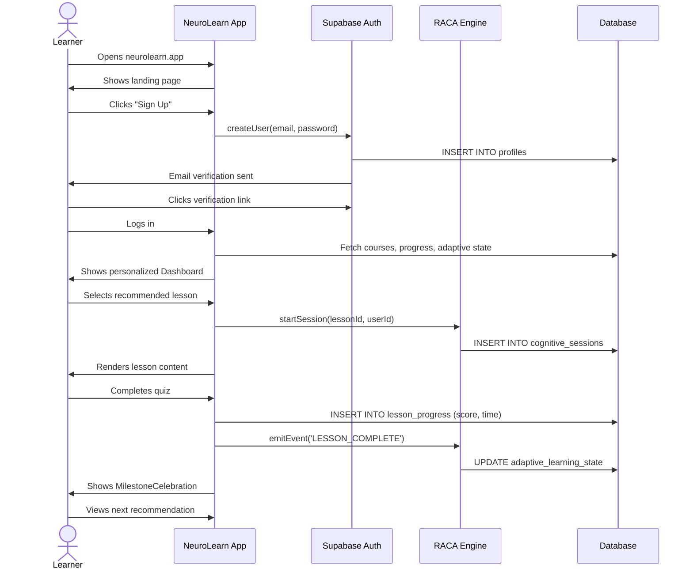
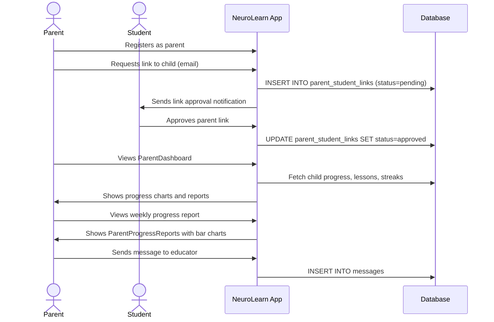
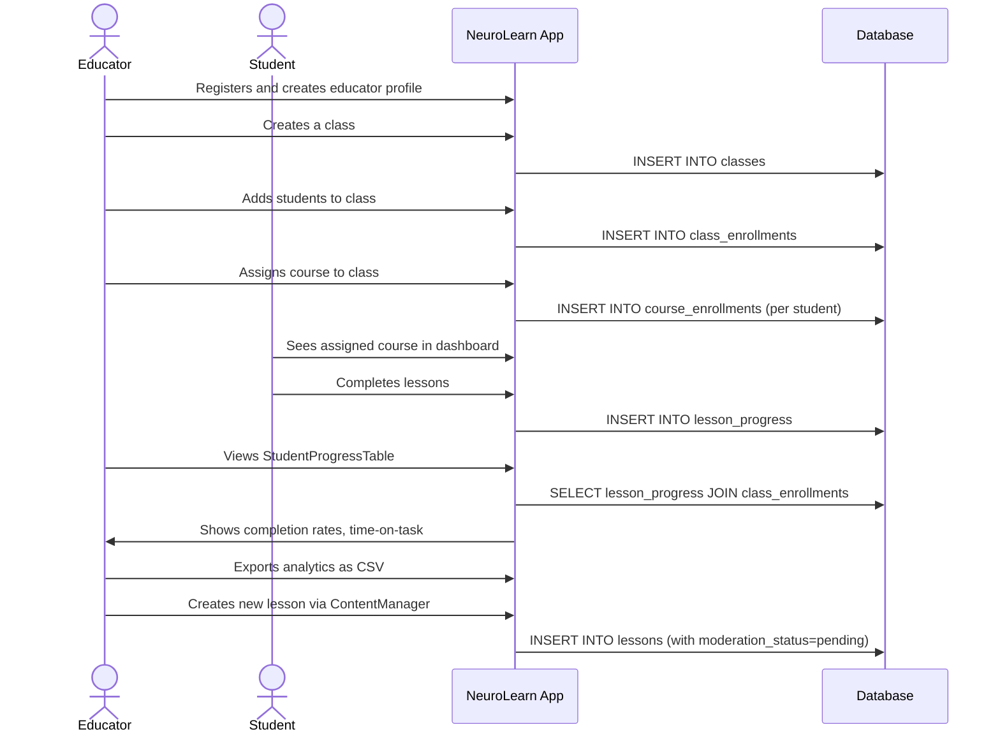

<objective>
Complete the platform: CI/CD migration automation, environment management, and user journey maps.
Purpose: Platform must deploy reliably across environments and documentation must be complete.
Output: CI migration step, environment docs, user journey maps — then the platform is 100% complete.
</objective>

<execution_context>
@.planning/PROJECT.md
@.planning/ROADMAP.md
</execution_context>

<context>
@.planning/PROJECT.md
@.planning/ROADMAP.md
@.github/workflows/ci.yml
@docs/other/environment-management.md
@docs/other/user-journey-maps.md
@.env.example
</context>

<tasks>
<task type="auto">
  <name>Task 1: Add DB migration step to CI/CD pipeline</name>
  <files>.github/workflows/ci.yml</files>
  <action>
Read the existing .github/workflows/ci.yml, then add a migration job or step.

Add a new job after the test job:

```yaml
migrate:
  name: Database Migrations
  runs-on: ubuntu-latest
  needs: [test] # Use actual job name from existing ci.yml
  if: github.ref == 'refs/heads/main' # Only on main branch push
  environment: production
  steps:
    - uses: actions/checkout@v4
    - uses: supabase/setup-cli@v1
      with:
        version: latest
    - name: Link Supabase project
      run: supabase link --project-ref ${{ secrets.SUPABASE_PROJECT_REF }}
      env:
        SUPABASE_ACCESS_TOKEN: ${{ secrets.SUPABASE_ACCESS_TOKEN }}
    - name: Run migrations
      run: supabase db push
      env:
        SUPABASE_ACCESS_TOKEN: ${{ secrets.SUPABASE_ACCESS_TOKEN }}
        SUPABASE_DB_PASSWORD: ${{ secrets.SUPABASE_DB_PASSWORD }}
```

Required GitHub secrets (document in job comment):

- SUPABASE_PROJECT_REF: Supabase project reference ID
- SUPABASE_ACCESS_TOKEN: Supabase management API token
- SUPABASE_DB_PASSWORD: Database password

Read the existing ci.yml carefully — use the actual existing job name in `needs:`. Place migrate after test, before lighthouse (if lighthouse job exists).
</action>
<verify>grep -l "supabase db push\|migrate" .github/workflows/ci.yml</verify>
<done>ci.yml has migrate job that runs supabase db push on main branch only</done>
</task>

<task type="auto">
  <name>Task 2: Write environment management documentation</name>
  <files>docs/other/environment-management.md</files>
  <action>
Read existing file then replace with comprehensive content covering:

## Environments

| Environment | Purpose                  | Supabase Project              | Vercel Branch       |
| ----------- | ------------------------ | ----------------------------- | ------------------- |
| local       | Developer machines       | `localhost` or local Supabase | N/A                 |
| staging     | QA + integration testing | Separate Supabase project     | Preview deployments |
| production  | Live users               | Production Supabase project   | `main` branch       |

## Environment Variables by Environment

| Variable                | local                  | staging                               | production                     |
| ----------------------- | ---------------------- | ------------------------------------- | ------------------------------ |
| VITE_SUPABASE_URL       | http://localhost:54321 | https://[staging-ref].supabase.co     | https://[prod-ref].supabase.co |
| VITE_APP_URL            | http://localhost:5173  | https://neurolearn-staging.vercel.app | https://neurolearn.app         |
| VITE_SENTRY_ENVIRONMENT | development            | staging                               | production                     |
| VITE*RACA_ENABLE*\*     | true (local dev)       | false                                 | feature-flag controlled        |

## Promotion Workflow

1. Feature developed on feature branch → PR → passes CI
2. Merge to `main` → deploys to staging automatically
3. QA verification on staging (human step — see staging checklist)
4. Tag release: `git tag v0.x.0 && git push origin v0.x.0`
5. Vercel promotes staging → production on tag push
6. DB migration runs automatically via CI migrate job

## Supabase Project Setup

- Local: `supabase start` (Docker required)
- New project: Supabase dashboard → New project → copy Project Ref and anon key
- Migrations: `supabase db push` (CI) or `supabase migration up` (local)

## Staging Checklist (human steps required)

- [ ] Login/logout flows work
- [ ] Lesson content loads
- [ ] RACA session starts and transitions
- [ ] Educator dashboard shows data
- [ ] Parent dashboard shows child links
- [ ] Admin dashboard loads and shows user list
- [ ] Sentry receives test error (call `Sentry.captureMessage('staging test')` in console)
      </action>
      <verify>wc -l docs/other/environment-management.md</verify>
      <done>environment-management.md has ≥80 lines, covers 3 environments, promotion workflow, and staging checklist</done>
      </task>

<task type="auto">
  <name>Task 3: Write user journey maps with Mermaid diagrams</name>
  <files>docs/other/user-journey-maps.md</files>
  <action>
Read existing file then replace with 3 complete user journey maps using Mermaid sequence diagrams:

## Learner Journey



## Parent Journey



## Educator Journey



Each diagram should be preceded by a brief narrative description of the journey.
</action>
<verify>grep -c "sequenceDiagram" docs/other/user-journey-maps.md</verify>
<done>user-journey-maps.md has 3 Mermaid sequenceDiagram blocks (learner, parent, educator)</done>
</task>

<task type="auto">
  <name>Task 4: Update STATE.md to mark completion</name>
  <files>.planning/STATE.md</files>
  <action>
Read .planning/STATE.md, then update it to reflect completion:

Replace the Active Phases table with all phases marked ✅ DONE.

Add at the bottom:

```markdown
## Platform Completion

**All 120 issues addressed — 2026-03-02**
Final CI gate status:

- npm run typecheck: ✅ 0 errors
- npm run lint: ✅ 0 warnings
- npm run test -- --run: ✅ all tests passing
- npm run build: ✅ clean build

The neurolearn platform is feature-complete. Ongoing work:

- Staging QA verification (human steps in environment-management.md)
- Sentry DSN configuration (requires real Supabase project)
- Playwright E2E activation (set PLAYWRIGHT_RUN=true with real environment)
- Lighthouse CI token setup (requires LHCI_GITHUB_APP_TOKEN secret)
```

  </action>
  <verify>grep -l "feature-complete\|DONE" .planning/STATE.md</verify>
  <done>STATE.md updated to show all phases ✅ DONE, platform completion documented</done>
</task>
</tasks>

<verification>
- [ ] npm run typecheck — 0 errors
- [ ] npm run lint — 0 warnings
- [ ] npm run test -- --run — all tests passing
- [ ] npm run build — clean build
- [ ] ci.yml has migrate job (runs only on main branch)
- [ ] environment-management.md has 3-environment table + promotion workflow
- [ ] user-journey-maps.md has 3 Mermaid sequenceDiagram blocks
- [ ] STATE.md shows all phases ✅ DONE
</verification>

<success_criteria>

- All 4 tasks completed
- CI gate passes
- Phase 17 (Observability & CI/CD) is 100% implemented
- STATE.md reflects platform completion
- NeuroLearn platform is 100% feature-complete (120/120 issues addressed)
  </success_criteria>

<output>
After completion, create `.planning/phases/17-observability/17-02-SUMMARY.md`.

**EXECUTION LOOP COMPLETE** — All 14 plans executed, all 7 phases complete, all 120 issues addressed.

Final state:

- Phase 11 (Educator Portal): ✅ DONE
- Phase 12 (Parent Portal): ✅ DONE
- Phase 13 (Admin Portal): ✅ DONE
- Phase 14 (Security & Compliance): ✅ DONE
- Phase 15 (Testing): ✅ DONE
- Phase 16 (Learner Features): ✅ DONE
- Phase 17 (Observability & CI/CD): ✅ DONE
  </output>
