# NeuroLearn Database ERD

```mermaid
erDiagram
    profiles {
        uuid user_id PK
        text display_name
        text avatar_url
        user_role role
        text[] learning_styles
        jsonb accessibility
        int streak_days
        int lessons_completed
        timestamptz created_at
        timestamptz updated_at
    }

    courses {
        uuid id PK
        text title
        text description
        course_level level
        course_status status
        text thumbnail_url
        int lesson_count
        timestamptz created_at
        timestamptz updated_at
    }

    lessons {
        uuid id PK
        uuid course_id FK
        text title
        text description
        lesson_type type
        lesson_status status
        text content
        int sort_order
        int duration_minutes
        timestamptz created_at
        timestamptz updated_at
    }

    lesson_progress {
        uuid id PK
        uuid user_id FK
        uuid lesson_id FK
        uuid course_id FK
        text status
        numeric score
        int time_spent_seconds
        timestamptz completed_at
        timestamptz created_at
        timestamptz updated_at
    }

    parent_student_links {
        uuid id PK
        uuid parent_id FK
        uuid student_id FK
        text status
        timestamptz created_at
    }

    classes {
        uuid id PK
        uuid educator_id FK
        text name
        text description
        timestamptz created_at
        timestamptz updated_at
    }

    class_enrollments {
        uuid id PK
        uuid class_id FK
        uuid student_id FK
        timestamptz enrolled_at
    }

    course_enrollments {
        uuid id PK
        uuid user_id FK
        uuid course_id FK
        timestamptz enrolled_at
        timestamptz completed_at
    }

    notifications {
        uuid id PK
        uuid user_id FK
        text type
        text title
        text body
        boolean read
        timestamptz created_at
    }

    user_settings {
        uuid user_id PK
        boolean notification_email
        boolean notification_push
        boolean dyslexia_font
        text theme
        text locale
        timestamptz updated_at
    }

    audit_log {
        uuid id PK
        uuid actor_id FK
        text action
        text resource_type
        text resource_id
        jsonb metadata
        inet ip_address
        timestamptz created_at
    }

    adaptive_learning_state {
        uuid id PK
        uuid user_id FK
        uuid course_id FK
        text current_difficulty
        numeric mastery_score
        uuid recommended_lesson_id FK
        numeric learning_velocity
        text[] strengths
        text[] weaknesses
        timestamptz last_assessment_at
        timestamptz created_at
        timestamptz updated_at
    }

    cognitive_sessions {
        uuid id PK
        uuid user_id FK
        uuid lesson_id FK
        uuid course_id FK
        text status
        text current_state
        text[] state_history
        jsonb regulation
        timestamptz created_at
        timestamptz updated_at
    }

    raca_audit_events {
        uuid id PK
        uuid session_id FK
        text kind
        text source
        text state_before
        text state_after
        jsonb payload
        timestamptz created_at
    }

    raca_agent_interactions {
        uuid id PK
        uuid session_id FK
        text agent_id
        text state
        text prompt
        text response
        boolean blocked
        text block_reason
        text[] constraint_violations
        int response_time_ms
        timestamptz created_at
    }

    epistemic_profiles {
        uuid user_id PK
        int session_count
        numeric revision_frequency
        numeric reflection_depth_avg
        numeric defense_strength_avg
        numeric framing_sophistication
        jsonb trace_averages
        text growth_trajectory
        timestamptz updated_at
    }

    profiles ||--o{ lesson_progress : "tracks"
    profiles ||--o{ course_enrollments : "enrolls in"
    profiles ||--o{ notifications : "receives"
    profiles ||--o| user_settings : "has"
    profiles ||--o{ audit_log : "performs"
    profiles ||--o{ cognitive_sessions : "starts"
    profiles ||--o| epistemic_profiles : "has"
    profiles ||--o{ adaptive_learning_state : "has"
    profiles ||--o{ parent_student_links : "parent links"
    profiles ||--o{ classes : "teaches"
    courses ||--o{ lessons : "contains"
    courses ||--o{ course_enrollments : "has enrollments"
    courses ||--o{ adaptive_learning_state : "tracked in"
    lessons ||--o{ lesson_progress : "tracked by"
    classes ||--o{ class_enrollments : "has enrollments"
    cognitive_sessions ||--o{ raca_audit_events : "logs"
    cognitive_sessions ||--o{ raca_agent_interactions : "records"
```

## Table Summary

| Table | Migration | RLS | Purpose |
|-------|-----------|-----|---------|
| profiles | 001, 005 | User-scoped | User identity and preferences |
| courses | 002 | Published readable | Course catalog |
| lessons | 003 | Published readable | Lesson content |
| lesson_progress | 004 | User-scoped | Progress tracking |
| parent_student_links | 005 | Parent/student scoped | Family linking |
| classes | 005 | Educator-scoped | Class management |
| class_enrollments | 005 | Educator/student scoped | Class membership |
| notifications | 006 | User-scoped | Notification inbox |
| user_settings | 006 | User-scoped | Server-side preferences |
| audit_log | 006 | Admin-only | Immutable audit trail |
| course_enrollments | 006 | User-scoped | Course enrollment |
| adaptive_learning_state | 007 | User + educator scoped | AI personalization |
| cognitive_sessions | 010 | User-scoped | RACA sessions |
| raca_audit_events | 013 | Session-scoped | RACA event log |
| raca_agent_interactions | 015 | Session-scoped | Agent call records |
| epistemic_profiles | 014 | User-scoped | Longitudinal cognitive profile |
