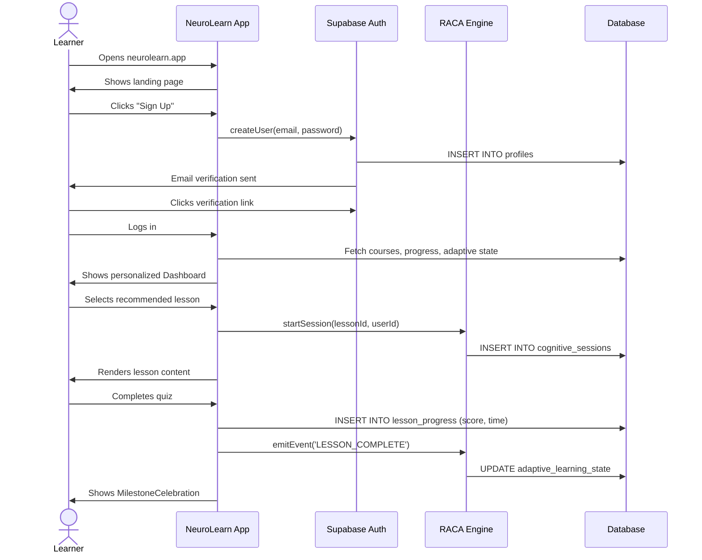
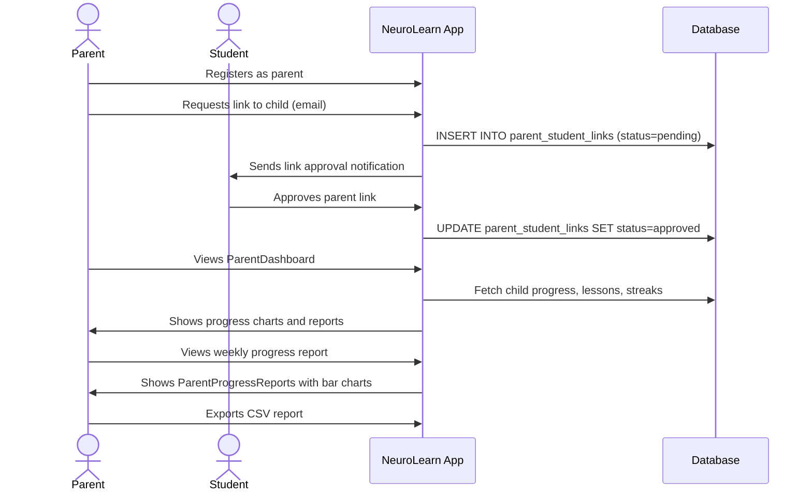
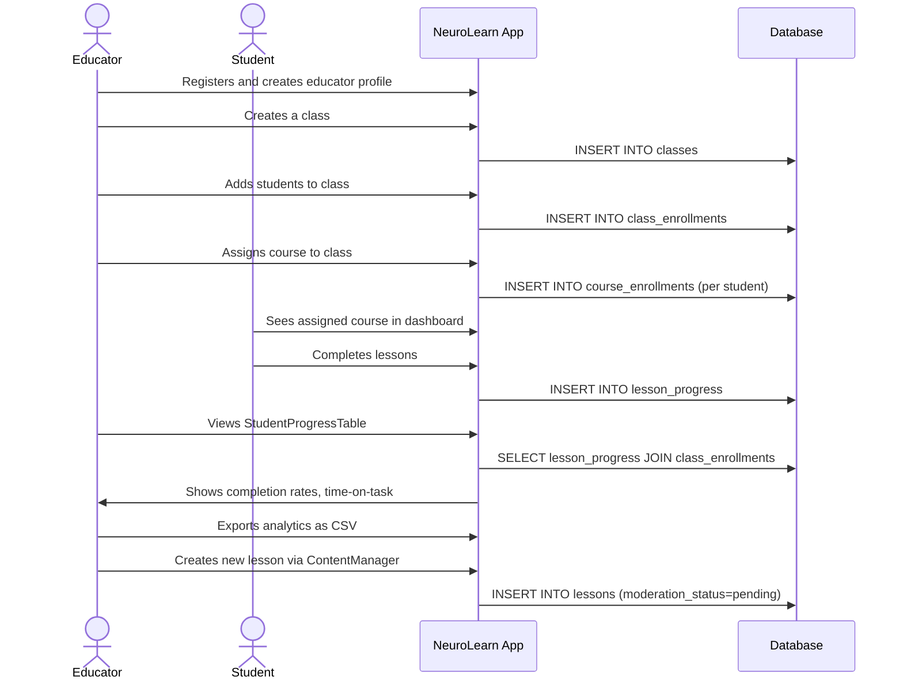

# User Journey Maps

## 1. Learner Journey

### Persona: Maya, 14, ADHD + Dyslexia

```
Discovery → Onboarding → First Session → Regular Use → Mastery
```

#### Stage 1: Discovery & Sign-Up
- **Action**: Arrives at homepage, clicks "Get Started"
- **Page**: HomePage → SignUpPage
- **Touchpoints**: Sign-up form (email + password)
- **Emotion**: Curious, slightly anxious
- **Accessibility**: Dyslexia font option shown early

#### Stage 2: Profile Setup
- **Action**: Sets learning styles, accessibility preferences
- **Page**: ProfilePage (after first login)
- **Touchpoints**: Learning style quiz, text size toggle, reduced motion toggle
- **Emotion**: Empowered by customization
- **Key moment**: "This app gets me"

#### Stage 3: First Course
- **Action**: Browses courses, enrolls in "Focus Fundamentals"
- **Page**: CoursesPage → CoursePage
- **Touchpoints**: Course cards, enrollment button, lesson list
- **Emotion**: Motivated, wants to start

#### Stage 4: First Lesson + RACA Session
- **Action**: Starts lesson, enters cognitive session
- **Page**: LessonPage → SessionPage
- **Touchpoints**:
  - ROOT: regulation check-in
  - REGULATE: self-assessment
  - POSITION: framing agent asks reflective questions
  - PLAN: research agent helps find sources
  - APPLY: drafts response with construction agent scaffold
  - REVISE: critique agent highlights gaps
  - DEFEND: defense agent asks probing questions
  - RECONNECT: reflect on learning
  - ARCHIVE: session saved
- **Emotion**: Challenged but supported, never overwhelmed
- **Smart reminders**: Break suggestion after 25 minutes
- **Key constraint**: AI never gives answers, only asks questions

#### Stage 5: Milestone + Continued Use
- **Action**: Completes 10th lesson → celebration
- **Touchpoints**: MilestoneCelebration modal, streak counter
- **Emotion**: Proud, motivated to continue
- **Adaptation**: Engine adjusts difficulty based on performance

#### Stage 6: Mastery
- **Action**: Completes course, reviews epistemic profile growth
- **Page**: DashboardPage, ProfilePage
- **Touchpoints**: Course completion badge, growth trajectory
- **Emotion**: Accomplished

---

## 2. Parent Journey

### Persona: David, parent of Maya

```
Invitation → Account Setup → Monitoring → Communication → Advocacy
```

#### Stage 1: Account Creation
- **Action**: Signs up as parent
- **Page**: SignUpPage (selects parent role during onboarding)
- **Touchpoints**: Sign-up form, role selection

#### Stage 2: Student Linking
- **Action**: Links to Maya's account
- **Page**: ParentDashboardPage → My Students tab
- **Touchpoints**: Student ID entry, pending → active approval
- **Emotion**: Wants visibility without invading privacy

#### Stage 3: Progress Monitoring
- **Action**: Reviews Maya's weekly progress
- **Page**: ParentDashboardPage → Progress Reports tab
- **Touchpoints**: Course progress bars, streak info, CSV export
- **Emotion**: Reassured by concrete data
- **Key moment**: "I can see she's actually learning"

#### Stage 4: Educator Communication
- **Action**: Messages Maya's teacher about accommodations
- **Page**: ParentDashboardPage → Messages tab
- **Touchpoints**: Educator list (auto-populated from class links), message thread
- **Emotion**: Collaborative, advocating for child

#### Stage 5: Notification Management
- **Action**: Sets weekly digest notification
- **Page**: ParentDashboardPage → Notifications tab
- **Touchpoints**: Frequency selector, contact method preference
- **Emotion**: In control of information flow

---

## 3. Educator Journey

### Persona: Ms. Reyes, 7th grade Science teacher

```
Onboarding → Class Setup → Content Creation → Monitoring → Reporting
```

#### Stage 1: Account & Profile Setup
- **Action**: Creates educator account, fills profile
- **Page**: SignUpPage → ProfilePage → EducatorDashboardPage
- **Touchpoints**: Subjects, certifications, school name
- **Emotion**: Professional, wants efficient tools

#### Stage 2: Class Management
- **Action**: Creates "7th Grade Science A" class, enrolls students
- **Page**: EducatorDashboardPage → Classes tab
- **Touchpoints**: Create class form, student enrollment
- **Emotion**: Organized

#### Stage 3: Content Creation
- **Action**: Creates custom lessons for her curriculum
- **Page**: EducatorDashboardPage → Content tab
- **Touchpoints**: Course creator, lesson editor, publish workflow
- **Emotion**: Creative, in control of curriculum

#### Stage 4: Course Assignment
- **Action**: Assigns "Focus Fundamentals" to all students
- **Page**: EducatorDashboardPage → Assignments tab
- **Touchpoints**: Class selector, course assignment per student
- **Emotion**: Efficient

#### Stage 5: Progress Monitoring
- **Action**: Reviews class-wide progress, identifies struggling students
- **Page**: EducatorDashboardPage → Student Progress tab
- **Touchpoints**: Class progress table, per-student course breakdown
- **Key moment**: Notices Maya's high revision frequency (strong learning pattern)

#### Stage 6: Analytics & Reporting
- **Action**: Exports class report for parent-teacher conference
- **Page**: EducatorDashboardPage → Analytics tab
- **Touchpoints**: Class metrics, completion rates, CSV export
- **Emotion**: Data-informed, professional

---

## 4. Admin Journey

### Persona: Dr. Hearn, platform administrator

```
System Monitoring → User Management → Content Moderation → Compliance
```

#### Stage 1: System Overview
- **Page**: AdminDashboardPage → Overview tab
- **Touchpoints**: System status, uptime, active sessions

#### Stage 2: User Management
- **Page**: AdminDashboardPage → Users tab
- **Actions**: Search users, filter by role, promote/demote roles
- **Key constraint**: Role changes logged to immutable audit trail

#### Stage 3: Content Moderation
- **Page**: AdminDashboardPage → Content Moderation tab
- **Actions**: Review drafts, publish/unpublish, archive inappropriate content
- **All actions logged to audit trail**

#### Stage 4: Analytics Review
- **Page**: AdminDashboardPage → Analytics tab
- **Actions**: Review platform-wide metrics, export CSV for reporting
- **Data**: Users by role, courses, lessons, completion rates

#### Stage 5: Audit Trail Review
- **Page**: AdminDashboardPage → Audit Log tab
- **Actions**: Filter by action type, paginate, export
- **Key property**: Immutable — entries cannot be modified or deleted
- **Compliance**: Supports FERPA audit requirements

---

## Sequence Diagrams

### Learner Session Flow



### Parent Monitoring Flow



### Educator Class Management Flow



---

## Journey Interconnections

```
Learner ←→ RACA Agents (AI-mediated learning)
   ↕
Parent ←→ Educator (messaging, progress visibility)
   ↕
Admin (oversight of all, audit trail, compliance)
```

All user journeys converge on:
- **Accessibility**: Every touchpoint respects reduced motion, dyslexia fonts, screen reader, keyboard nav
- **Privacy**: RLS ensures users only see data they're authorized for
- **Audit**: Every significant action is logged immutably
- **Adaptation**: The system adapts to each user's needs, never labels
